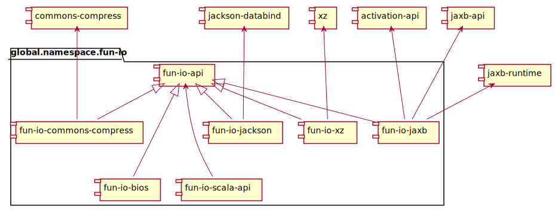

# Fun I/O [](http://search.maven.org/#search%7Cga%7C1%7Cg%3A%22global.namespace.fun-io%22) [](https://travis-ci.org/christian-schlichtherle/fun-io)

Fun I/O provides functional, high level abstractions for codecs, transformations, sockets, stores, archives et al.
Fun I/O supports Java 8 or later and Scala 2.10, 2.11 and 2.12 and is covered by the Apache License, version 2.0.

## Features

+ Composes low level `InputStream`s and `OutputStream`s into high level `Codec`s, `Transformation`s, `Store`s, 
  `ArchiveStore`s et al.
+ These abstractions are easy to implement, highly reusable and provide a high level of interoperability so that they 
  can be easily composed into complete I/O subsystems.
+ Proper resource management: Streams are properly closed, even if there is an exception in a nested constructor.
  Say goodbye to resource leaks and try-with-resources statements.
+ Supports Java and Scala equally well via dedicated APIs.

## Usage

### Basic I/O

The following Scala code prints `"Hello world!"` - including the quotes:

```scala
import global.namespace.fun.io.api._             // from module `fun-io-api`
import global.namespace.fun.io.bios.BIOS._       // from module `fun-io-bios`
import global.namespace.fun.io.jackson.Jackson._ // from module `fun-io-jackson`

val encoder: Encoder = json encoder stdout
encoder encode "Hello world!"
```

Here's the equivalent in Java:

```java
import global.namespace.fun.io.api.*;

import static global.namespace.fun.io.bios.BIOS.*;
import static global.namespace.fun.io.jackson.Jackson.*;

...

Encoder encoder = json().encoder(stdout());
encoder.encode("Hello world!");
```

The preceding code encodes the string `"Hello world!` to JSON and writes it to `System.out`.
The call to `stdout()` wraps `System.out` in a socket which ignores any call to the `OutputStream.close()` method as it 
would be inappropriate to do that on `System.out`.
The `stream` function allows to do the same for any given `InputStream` or `OutputStream`.
 
Note that the `encoder` object is virtually stateless, and hence reusable.

Here is a more realistic, yet incomplete example in Scala:

```scala
import global.namespace.fun.io.api._             // from module `fun-io-api`
import global.namespace.fun.io.bios.BIOS._       // from module `fun-io-bios`
import global.namespace.fun.io.jackson.Jackson._ // from module `fun-io-jackson`
import global.namespace.fun.io.scala.api._       // from module `fun-io-scala-api`
import java.nio.file.Paths

def ciphers(forOutput: Boolean): javax.crypto.Cipher = ??? // needs to return an initialized cipher
val store: Store = path(Paths get "hello-world.gz.cipher")
val connectedCodec: ConnectedCodec = json << gzip << cipher(ciphers _) << store
connectedCodec encode "Hello world!"
```

Note that the `<<` operator is associative.

Here's the equivalent in Java: 

```java
import global.namespace.fun.io.api.*;
import global.namespace.fun.io.api.function.*;
import java.nio.file.Paths;

import static global.namespace.fun.io.bios.BIOS.*;
import static global.namespace.fun.io.jackson.Jackson.*;

...

XFunction<Boolean, Cipher> ciphers = forOutput -> { throw new IOException("not implemented"); };
Store store = pathStore(Paths get "hello-world.gz.cipher");
ConnectedCodec connectedCodec = json().map(gzip()).map(cipher(ciphers)).connect(store);
connectedCodec.encode("Hello world!");

```

Note that an `XFunction` is like a `java.util.function.Function`, except that it may throw an `Exception`. 

Assuming a complete implementation of the `ciphers` function, the preceding code would first encode the string 
`"Hello world!"` to JSON, then compress the result using the GZIP format, then encrypt the result using a cipher 
returned from an internal call to `ciphers.apply(true)` and finally save the result to the file `hello-world.gz.cipher`.

Again, note that the `store` and `connectedCodec` objects are virtually stateless, and hence reusable.

### Archive Processing

#### Diffing two JAR files and generating a delta JAR file

The following code diffs two JAR files and generates a delta JAR file.
It uses the `Compress` facade to access the JAR files using Apache Commons Compress.
It also uses the `Delta` facade for the actual diffing:

```java
import java.io.File;

import static global.namespace.fun.io.commons.compress.CommonsCompress.*;
import static global.namespace.fun.io.delta.Delta.*;

File base = ...;
File update = ...;
File delta = ...;
diff().base(jar(base)).update(jar(update)).to(jar(delta));
```

If you wanted to use the `fun-io-bios` module instead of the `fun-io-commons-compress` module, then, apart from
configuring the class path, you would only have to edit the `import` statement as shown in the next example.

#### Patching a JAR file with a delta JAR file to another JAR file

The following code patches a JAR file with a delta JAR file to another JAR file.
It uses the `BIOS` facade to access the JAR files using the JRE.
It also uses the `Delta` facade for the actual patching:

```java
import java.io.File;

import static global.namespace.fun.io.bios.BIOS.*;
import static global.namespace.fun.io.delta.Delta.*;

File base = ...;
File update = ...;
File delta = ...;
patch().base(jar(base)).delta(jar(delta)).to(jar(update));
```

#### Diffing two directories and computing a delta model

Maybe you just want to examine the delta of two directories, but not generate a delta archive file or directory from 
that?
The following code diffs two directories and computes a delta model.
Again, the `Delta` and the `BIOS` facades can be used to do that:

```java
import java.io.File;

import global.namespace.fun.io.delta.model.*;

import static global.namespace.fun.io.bios.BIOS.*;
import static global.namespace.fun.io.delta.Delta.*;

File base = ...;
File update = ...;
DeltaModel model = diff().base(directory(base)).update(directory(update)).toModel();
```

The delta model has properties describing the changed, unchanged, added and removed entries.

## Module Structure and Features

Fun I/O has a modular structure.
Its artifacts are hosted on Maven Central with the common group ID 
[`global.namespace.fun-io`](http://search.maven.org/#search%7Cga%7C1%7Cglobal.namespace.fun-io).
The following diagram shows the module structure:



The modules are:

+ `fun-io-api`: The API provides interfaces for `Codec`s, `Transformation`s, `Socket`s, `Store`s, `ArchiveStore`s et al.
+ `fun-io-scala-api`: The Scala API extends the Java API with operators and implicit conversions to improvie the user 
   experience in Scala.
+ `fun-io-bios`: The Basic Input/Output System (pun intended) provides basic implementations of the Fun I/O API.
  + The `BIOS` class is a facade which provides the following `Codec` functions:
    + `serialization` serializes/deserializes objects using `ObjectOutputStream`/`ObjectInputStream`.
    + `xml` encodes/decodes objects using `XMLEncoder`/`XMLDecoder`.
  + It also provides the following `Transformation` functions:
    + `base64` encodes/decodes data to/from Base64.
    + `buffer` buffers I/O operations.
    + `cipher` encrypts/decrypts data using a function which provides initialized `javax.security.Cipher` objects.
    + `deflate` deflates/inflates data using the ZIP compression.
    + `gzip` compresses/decompresses data using the GZIP compression format.
    + `identity` is a no-op, forming transformations into a [Monoid].
    + `inflate` inflates/deflates data using the ZIP compression.
    + `inverse` inverses a given transformation by buffering the entire data to a buffer, e.g. on the heap.
    + `rot` provides the (in)famous ROT transformation, e.g. [ROT13].
  + It also provides the following `Source` functions:
    + `resource` reads a resource from the class path.
    + `stdin` reads the standard input.
    + `stream` reads an arbitrary input stream without ever closing it.
  + It also provides the following `Sink` functions:
    + `stderr` writes to standard error.
    + `stdout` writes to standard output.
    + `stream` write to an arbitrary output stream without ever closing it.
  + It also provides the following `Store` functions:
    + `file` stores data in a file, based on `java.io.File`. 
    + `memory` stores data on the heap. This is primarily used for cloning objects or testing.
    + `path` stores data in a files or any other path, based on `java.nio.file.Path`.
    + `preferences` stores data in a preferences node using a given key.
    + `systemPreferences` stores data in a system preferences nodes representing a given class.
    + `userPreferences` stores data in a user preferences nodes representing a given class.
  + It also provides the following `ArchiveStore` functions:
    + `directory` provides access to a directory as if it were an archive file.
    + `jar` provides access to JAR files.
    + `zip` provides access to ZIP files.
  + It also provides the following utility functions:
    + `copy` is a high performance algorithm for copying data from a `Source` to a `Sink`, including `Store`s.
    + `clone` duplicates an object by serializing it to memory and decoding it again.  
+ `fun-io-commons-compress`: Depends on [Apache Commons Compress] to provide implementations of the Fun I/O API.
  + The `CommonsCompress` class is a facade which provides the following `Transformation` functions: 
    + `blockLZ4` compresses/decompresses data using the LZ4 block format.
    + `bzip2` compresses decompresses data using the BZIP2 format.
    + `deflate` deflates/inflates data using the ZIP compression.
    + `framedLZ4` compresses/decompresses data using the LZ4 frame format.
    + `framedSnappy` compresses/decompresses data using the Snappy frame format.
    + `gzip` compresses/decompresses data using the GZIP compression format.
    + `lzma` compresses/decompresses data using the LZMA compression format.
    + `lzma2` compresses/decompresses data using the LZMA2 compression format.
  + It also provides the following `ArchiveStore` functions:
    + `jar` provides access to JAR files.
    + `zip` provides access to ZIP files.
+ `fun-io-delta` provides utility functions for diffing and patching archive files or directories.
  + The `Delta` class is a facade which provides the following utility functions:
    + `diff` compares two archive files or directories to compute a delta archive file or directory or model.
    + `patch` patches an archive file or directory with a delta archive file or directory.
+ `fun-io-jackson`: Depends on [Jackson Databind] to provide implementations of the Fun I/O API. 
  + The `Jackson` class is a facade which provides the following `Codec` functions:
    + `json` marshals/unmarshals objects to/from JSON using Jackson Databind.
+ `fun-io-jaxb`: Depends on [JAXB] to provide implementations of the Fun I/O API.
  + The `JAXB` class is a facade which provides the following `Codec` functions:
    + `xml` marshals/unmarshals objects to/from XML using the JAXB reference implementation.
+ `fun-io-xz`: Depends on [XZ for Java] to provide implementations of the Fun I/O API.
  + The `XZ` class is a facade which provides the following `Transformation` functions:
    + `lzma2` compresses/decompresses data using the LZMA2 compression format.
    + `xz` compresses/decompresses data using the XZ compression format.

A typical Java application has a single dependency on `fun-io-bios`.
Additional module dependencies may be added to the mix to take advantage of their respective features.

A typical Scala application has the same dependency/dependencies as a Java application plus an additional dependency on
`fun-io-scala-api` to improve the user experience in Scala. 

[Apache Commons Compress]: https://commons.apache.org/proper/commons-compress/
[Jackson Databind]: http://wiki.fasterxml.com/JacksonHome
[JAXB]: https://javaee.github.io/jaxb-v2/
[Monoid]: https://en.wikipedia.org/wiki/Monoid
[ROT13]: https://en.wikipedia.org/wiki/ROT13
[XZ for Java]: https://tukaani.org/xz/
